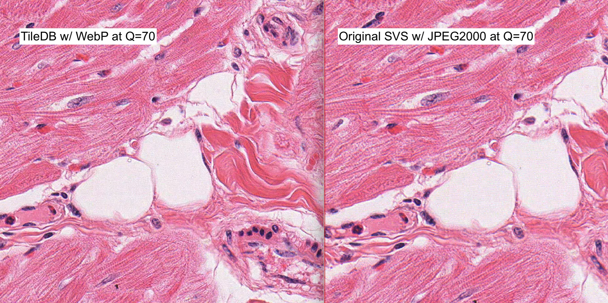

# Background

This repository contains a demonstration of the conversion of an Aperio format SVS image into a TileDB multi-resolution array group using the [TileDB BioImg](https://pypi.org/project/tiledb-bioimg/) library. We compare the compressed image size to that of the original with lossy compression applied in both cases.

The source data for this demo comes from the OpenSlide data repository: https://openslide.cs.cmu.edu/download/openslide-testdata/Aperio/ ([image link](https://openslide.cs.cmu.edu/download/openslide-testdata/Aperio/JP2K-33003-2.svs)).

# Setup

To run the full demo, please clone this git repository:

```
git clone https://github.com/TileDB-Inc/bioimg-compression-demo
```

We have included a conda environment with all dependencies for this demo. After installing [mamba](https://mamba.readthedocs.io/en/latest/installation.html) (recommended) or [conda](https://conda.io/projects/conda/en/latest/user-guide/install/index.html), create the test environment using:

```
mamba env create -f environment.yml
# or
conda env create -f environment.yml
```

Alternatively, all packages are available on PyPI:
```
pip install tiledb openslide-python tiledb-bioimg
```

Activate the environment created above:

```
conda activate bioimg-compression-demo
```

# Execution

After activating the python environment, run the demo script within the repository directory:

```
cd bioimg-compression-demo

python demo.py
```

# Comparison

We have converted the SVS image to a group of TileDB arrays stored with *lossy* WebP compression at quality=70%.

## Original SVS file

The original file size is 276MB:

```
-rw-r--r--@  1 inorton  staff   276M Apr 27 08:51 JP2K-33003-2.svs
```

The file is stored with JPEG2000 compression, with lossy compression applied at quality factor 70% (Q=70):

<details>

```
$ tiffinfo JP2K-33003-2.svs
=== TIFF directory 0 ===
TIFF Directory at offset 0x10817050 (276918352)
  Subfile Type: (0 = 0x0)
  Image Width: 32671 Image Length: 47076 Image Depth: 1
  Tile Width: 256 Tile Length: 256
  Bits/Sample: 8
  Compression Scheme: 33003 (0x80eb)
  Photometric Interpretation: RGB color
  Samples/Pixel: 3
  Planar Configuration: single image plane
  ImageDescription: Aperio Image Library v10.0.50
34000x47176 [0,100 32671x47076] (256x256) J2K/YUV16 Q=70|AppMag = 40|StripeWidth = 1000|ScanScope ID = SS1283|Filename = 6811|Title = univ missouri 07.15.09|Date = 07/16/09|Time = 21:59:00|User = 93d70f65-3b32-4072-ba6a-bd6785a781be|MPP = 0.2498|Left = 44.815720|Top = 18.114859|LineCameraSkew = -0.003035|LineAreaXOffset = 0.000000|LineAreaYOffset = 0.000000|Focus Offset = -0.001000|DSR ID = homer|ImageID = 6811|OriginalWidth = 34000|Originalheight = 47176|Filtered = 3|ICC Profile = ScanScope v1
  ICC Profile: <present>, 141992 bytes
=== TIFF directory 1 ===
TIFF Directory at offset 0x10877b40 (277314368)
  Subfile Type: (0 = 0x0)
  Image Width: 532 Image Length: 768 Image Depth: 1
  Bits/Sample: 8
  Compression Scheme: JPEG
  Photometric Interpretation: RGB color
  YCbCr Subsampling: 2, 2
  Samples/Pixel: 3
  Rows/Strip: 16
  Planar Configuration: single image plane
  ImageDescription: Aperio Image Library v10.0.50
32671x47076 -> 532x768 - |AppMag = 40|StripeWidth = 1000|ScanScope ID = SS1283|Filename = 6811|Title = univ missouri 07.15.09|Date = 07/16/09|Time = 21:59:00|User = 93d70f65-3b32-4072-ba6a-bd6785a781be|MPP = 0.2498|Left = 44.815720|Top = 18.114859|LineCameraSkew = -0.003035|LineAreaXOffset = 0.000000|LineAreaYOffset = 0.000000|Focus Offset = -0.001000|DSR ID = homer|ImageID = 6811|OriginalWidth = 34000|Originalheight = 47176|Filtered = 3|ICC Profile = ScanScope v1
  JPEG Tables: (289 bytes)
=== TIFF directory 2 ===
TIFF Directory at offset 0x112d707a (288190586)
  Subfile Type: (0 = 0x0)
  Image Width: 8167 Image Length: 11769 Image Depth: 1
  Tile Width: 256 Tile Length: 256
  Bits/Sample: 8
  Compression Scheme: 33003 (0x80eb)
  Photometric Interpretation: RGB color
  Samples/Pixel: 3
  Planar Configuration: single image plane
  ImageDescription: Aperio Image Library v10.0.50
34000x47176 [0,100 32671x47076] (256x256) -> 8167x11769 J2K/YUV16 Q=70

## Other levels omitted

```

</details>

## Converted TileDB image

The converted TileDB bioimage array size is:

```
img-compression-demo ❯ du -sh JP2K-33003-2.tiledb
200M	JP2K-33003-2.tiledb
```

Note that this conversion includes the 3 pyramidal layers, but not the two additional TIFF pages with `Subfile Type: reduced-resolution image` in the TIFF file, however those TIFF pages are very small so the file sizes here are dominated by the high-resolution levels.

## Side by side



# Discussion

In this demo we have converted an Aperio SVS image into a TileDB multi-resolution array group with similar compression settings to the original. There is room to increase the Q factor for the TileDB array to save with higher quality if needed.